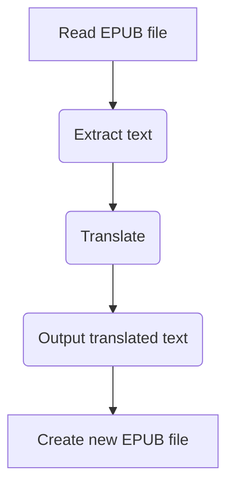
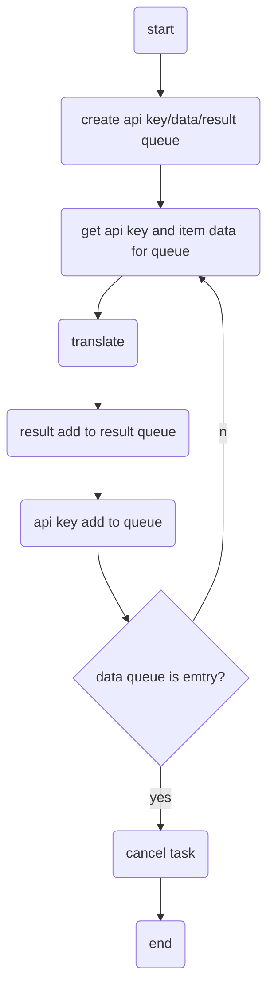

# Bilinguify

## How to set environment

The usage of installing third-party packages using `poetry` or `pip` are as follows:

### poetry

Create the virtualenv inside the project’s root directory. (suggestion)

```shell
poetry config virtualenvs.in-project true
poetry config virtualenvs.create true
```

[virtualenvs.in-project](https://python-poetry.org/docs/configuration/#virtualenvsin-project)

The shell command spawns a shell, according to the $SHELL environment variable, within the virtual environment. If one doesn’t exist yet, it will be created.

```shell
poetry shell
```

The install command reads the pyproject.toml file from the current project, resolves the dependencies, and installs them.

```shell
poetry install
```

### pip

```shell
pip install -r requirements.txt
```

## Work flow

### main flow



### translate flow


